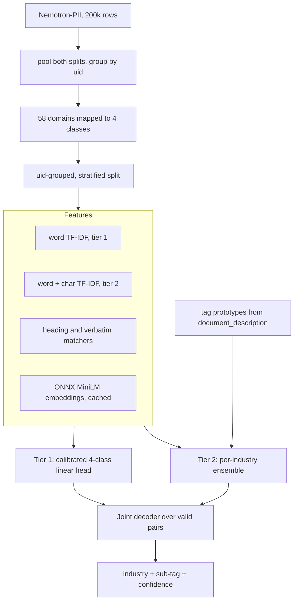

# tag-master

A two-tier document classifier over [`nvidia/Nemotron-PII`](https://huggingface.co/datasets/nvidia/Nemotron-PII).

**Tier 1** decides whether a document belongs to **healthcare**, **finance**, **government**, or **other**.
**Tier 2** then names the specific document sub-tag within that industry, out of 635 sub-tags.

Everything trains and evaluates on CPU. No GPU, no API keys, no gated downloads.

## Results

Measured on a held-out test split of 30,006 rows, grouped by `uid` so no document's
locale twin is ever visible during training.

| Metric | Result |
| --- | --- |
| Tier-1 accuracy (4-class) | **0.9741** |
| Tier-1 macro-F1 | **0.9416** |
| Tier-2 accuracy, given the industry is right | **0.9082** |
| End-to-end exact match (both tiers, all rows) | **0.9561** |
| End-to-end exact match (industry rows only) | **0.8342** |

Both targets in the brief -- 0.90 at tier 1 and 0.90 at tier 2 -- are met.

The last row is the one most likely to be misread, so it is reported separately
and deliberately. Two independent tiers at 0.90 multiply to roughly 0.81
end-to-end, and quoting a per-tier number as if it covered both would overstate
the model by about nine points. On documents that really belong to one of the
three industries, the model gets **both** the industry and the exact sub-tag
right 83.4% of the time.

Per tier-1 class:

| Class | Support | Precision | Recall | F1 |
| --- | --- | --- | --- | --- |
| healthcare | 1,604 | 0.925 | 0.892 | 0.908 |
| finance | 3,306 | 0.964 | 0.945 | 0.954 |
| government | 1,508 | 0.952 | 0.889 | 0.919 |
| other | 23,588 | 0.980 | 0.989 | 0.985 |

Per industry at tier 2:

| Industry | Sub-tags | Tier-1 recall | Tier-2 given correct industry | End-to-end |
| --- | --- | --- | --- | --- |
| healthcare | 135 | 0.892 | 0.894 | 0.798 |
| finance | 315 | 0.945 | 0.900 | 0.851 |
| government | 185 | 0.889 | 0.941 | 0.837 |

Full reports, including confusion matrices, coverage curves, and per-domain error
breakdowns, are written to [`reports/`](reports/).

## What the dataset actually contains

Three things about `nvidia/Nemotron-PII` are not what they appear, and each one
silently corrupts results if ignored. All were verified against the raw parquet
files rather than the dataset card.

**It is not an industry dataset.** It is a PII span-annotation corpus; the
industry labels are incidental metadata. The industry column is `domain` and it
holds **58 distinct values**, not three. The sub-tag column is `document_type`,
which is free text rather than a controlled vocabulary.

**The shipped train/test splits are unusable as-is.** Their `domain` vocabularies
are near-disjoint: only `Insurance` appears in both. `Healthcare`, `Government`,
and `Finance` occur *only* in the train split, while test substitutes `Health`,
`Healthcare Providers`, `Banking`, `Credit`, `Brokerage`, `Investment`,
`Mortgage`, `Public Safety`, and `Elections`. Training on one and evaluating on
the other is impossible for this label set, so both are pooled and re-split.

**Every record appears twice.** Each logical document has a `us` and an `intl`
rendering sharing one `uid`: 200,000 rows but 100,000 records. Splitting on rows
puts a near-duplicate of most test documents into training. All splitting here is
on `uid`.

### On the "151 industry tags"

There is no 151-tag inventory in this dataset, and the number is not recoverable.

Filtering to literally `Healthcare` + `Government` + `Finance` yields **176**
distinct sub-tags (healthcare 53, government 71, finance 53). That count is
stable under every normalisation tried: case-folding, per-locale, per-format, and
frequency cutoffs all return 176. Under the domain mapping this project actually
uses, the count is **635**.

A brute-force search over all 2-, 3-, and 4-domain combinations found 942
different groupings whose sub-tags happen to total 151 — none of them the
canonical healthcare/government/finance trio. So 151 is a numerical coincidence
rather than a grouping that can be reverse-engineered, and this project reports
the real count instead of forcing the label space to match it.

### The domain mapping

The adjacent-domain problem is the one that decides whether 90% is reachable at
all. A naive "everything outside the big three is other" rule teaches the model
that a `Banking` loan application is `other` while a `Finance` loan application
is `finance`. Concretely, 75 of the 176 strict sub-tags are also used by other
domains: "patient consent form" appears under Pharmaceuticals, Health,
Healthcare Providers *and* Healthcare; "credit report" under Brokerage, Credit,
Banking, Mortgage *and* Finance. Those contradictions, not model capacity, are
what would cap accuracy.

So domains are merged semantically ([`configs/taxonomy.yaml`](configs/taxonomy.yaml)):

- **healthcare** — Healthcare, Health, Healthcare Providers
- **finance** — Finance, Banking, Credit, Brokerage, Investment, Mortgage
- **government** — Government, Public Safety, Elections
- **other** — the remaining 46 domains

Domains that stay in `other` but sit next to an industry (Legal, Civil Rights,
Pharmaceuticals, Insurance, and others) are declared as `hard_negative_domains`
and up-weighted during tier-1 training. An early baseline reached only 0.623
precision on government because of them; it is now 0.952.

## Architecture



### Two feature profiles, not one

Tier 1 is a topical four-class decision over all 140k training rows, where word
n-grams suffice and character n-grams would cost roughly 700M nonzeros. Tier 2
separates near-duplicate form names inside a single industry (at most 15k rows),
where sub-word shape carries real signal — the corpus is full of field labels and
identifiers like `Medical Record Number:` and `IRS 1040` — and the matrices stay
small enough to afford it.

### Tier 2 is an ensemble, because no single scorer covers the label space

Median sub-tag support is 25 records for healthcare, 21 for finance, 18 for
government, and the thinnest government tag has 2. Five channels are z-normalised
per document and mixed with weights found by multi-start coordinate ascent on dev:

- **linear** — a LinearSVC, strongest on well-supported tags.
- **rocchio** — a nearest-centroid scorer. Averaging within a class instead of
  fitting a boundary degrades far more gracefully as support thins.
- **heading** — IDF-weighted coverage of the tag name by an extracted title.
- **verbatim** — the tag occurring anywhere in the body, position-weighted.
- **prototype** — cosine similarity to a dense prototype built from the tag's
  name and descriptions, which is what gives a two-example tag any
  representation at all.

Single-start coordinate ascent gets trapped and leaves the centroid at zero
weight despite it scoring 0.80-0.90 alone, so several starting points are tried.

The lexical channels exist because the sub-tag appears verbatim in the document
72% of the time. Exact heading equality alone recovers only 25% of labels,
though, because unstructured documents state the tag mid-sentence ("This
Brokerage and Investment Agreement is entered into...") and structured titles
pick up domain prefixes. Splitting structural and verbatim evidence into separate
channels, and letting the ensemble weight them independently, takes the
lexical-only signal to 62-76% top-1 on its own.

### Joint decoding

Gating tier 2 behind tier 1 discards the sharpest signal available: a document
containing "voter registration form" pins the industry far harder than its
general topical vocabulary does. So every valid pair is scored,

```
score(industry, sub_tag) = log P(industry | x) + lambda * log P(sub_tag | x, industry)
```

and the global argmax wins, letting tier-2 evidence override tier 1. `other`
carries no sub-tag and contributes only its tier-1 term. `lambda = 0` reproduces
the plain gated pipeline, which makes the tuned value directly interpretable.

Calibration differs by tier on purpose. Tier 1 uses multinomial Platt scaling
over its four margins; tier 2 uses a single temperature, because a 315-feature
multinomial fit against 3.3k dev rows would overfit immediately.

### Confusion-driven canonicalisation

Some sub-tags are not merely hard to separate but genuinely indistinguishable:
finance carries "investment plan", "investment strategy", "investment roadmap",
and "investment approach" as separate labels. Merging them is not cheating, it is
admitting the label space is finer than the evidence — but it has to come from
measured confusion rather than string similarity.

Merges are learned from the **dev** confusion graph and scored on test, so the
coarse numbers are not fitted to the split they are reported on. Collapsing 635
sub-tags to 576 lifts tier-2 accuracy from 0.901 to 0.917. Recovered clusters
include `{bic code document, swift code document}`, `{blood test report, medical
blood test result}`, and `{ballot request form, voter absentee ballot request,
voter absentee request form}`.

This uses **complete** linkage, not average linkage. Average linkage lets one
strong link drag in tags with zero mutual affinity, because the mean across cross
pairs still clears a low threshold. An early prototype that merged on token-set
containment collapsed 120 finance tags into a single cluster running from
"investment strategy" all the way to "savings account". Complete linkage makes
the weakest cross-cluster pair decide, which holds even at aggressive thresholds.

The output is a reviewable [`tag_aliases.json`](artifacts/models/) rather than
something applied silently, and both granularities are always reported.

## Usage

```bash
python -m venv .venv && source .venv/bin/activate
pip install -e ".[dev]"

tagmaster prepare          # download, split, derive the label space
tagmaster warm-cache       # optional: pre-compute embeddings (~55 min, cached)
tagmaster train            # fit both tiers, tune the decoder on dev
tagmaster evaluate --split test
tagmaster predict --file document.txt
```

`prepare` downloads 307 MB of parquet. `warm-cache` is optional but worthwhile:
embedding runs at about 58 documents/second on four CPU threads, so doing it once
up front keeps later runs fast. Training without it still works — the embeddings
are simply computed on demand and cached then.

To skip embeddings entirely, `tagmaster train --skip-embeddings`, or set
`features.embedding.enabled: false`. This costs roughly a point of accuracy and
removes the prototype channel.

Example output:

```json
{
  "industry": "government",
  "sub_tag": "voter registration form",
  "industry_confidence": 0.9986,
  "sub_tag_confidence": 0.9421,
  "industry_probabilities": {
    "healthcare": 0.0002, "finance": 0.0006,
    "government": 0.9986, "other": 0.0006
  },
  "alternatives": [
    {"industry": "government", "sub_tag": "voter registration form", "score": -0.093},
    {"industry": "government", "sub_tag": "voter registration card", "score": -3.412},
    {"industry": "government", "sub_tag": "voter registration change form", "score": -4.008}
  ]
}
```

Inference takes document text only. `document_description` names the source
domain in 93% of rows and seeds the tier-2 prototypes during training, but it is
dataset metadata rather than part of the document, so it never reaches inference.

## Methodology

`train` fits every model, `dev` selects every hyperparameter (regularisation
strength, ensemble weights, calibration, the joint lambda, and the
canonicalisation threshold), and `test` is touched only by `evaluate`.

The tier-2 label space is derived from the **training** split alone. A sub-tag
first seen at evaluation time is genuinely unpredictable, and counting it in the
vocabulary would quietly inflate the denominator instead of showing up as an
error. `reports/prepare.json` records the unseen-tag rate; it is 0.0 here.

Two robustness slices are reported that the shipped split cannot provide. The
**locale** slice is the meaningful one: every record exists in a `us` and an
`intl` rendering, so a gap between them would mean the model latched onto surface
locale cues. There is none — 0.9743 against 0.9740. Structured documents score
0.9814 and unstructured 0.9671, which is the expected gap given that structured
documents carry explicit titles.

## Layout

```
configs/taxonomy.yaml     domain mapping, hard negatives, all tunables
src/tagmaster/
  taxonomy.py             58-to-4 mapping, tag normalisation, alias handling
  data.py                 download, pooling, uid-grouped splitting
  prepare.py              label-space derivation and data reports
  headings.py             title extraction, heading and verbatim channels
  embed.py                ONNX MiniLM encoder with a content-hash cache
  features.py             the two feature profiles
  models.py               tier heads, calibrators, ensemble members
  hierarchy.py            joint decoding over (industry, sub-tag) pairs
  canonicalize.py         confusion-graph merging under complete linkage
  evaluate.py             metrics, coverage curves, error analysis
  predict.py              inference API
  cli.py                  command line entry point
tests/                    74 tests, no dataset download required
reports/                  generated metrics
```

Tests run in about a second and need no network: the end-to-end test drives the
real training functions over a synthetic corpus that reproduces the dataset's
`uid` pairing.

## Attribution

Data: [`nvidia/Nemotron-PII`](https://huggingface.co/datasets/nvidia/Nemotron-PII),
licensed **CC BY 4.0** and marked ready for commercial use.

```bibtex
@misc{nvidia2025nemotronpii,
  title  = {Nemotron-PII},
  author = {NVIDIA},
  year   = {2025},
  url    = {https://huggingface.co/datasets/nvidia/Nemotron-PII}
}
```

Embeddings: [`Xenova/all-MiniLM-L6-v2`](https://huggingface.co/Xenova/all-MiniLM-L6-v2), Apache-2.0.

NVIDIA notes that because the corpus is synthetic, models trained on it should be
validated against real deployment data rather than benchmark numbers alone. That
caution applies squarely to the results above.
